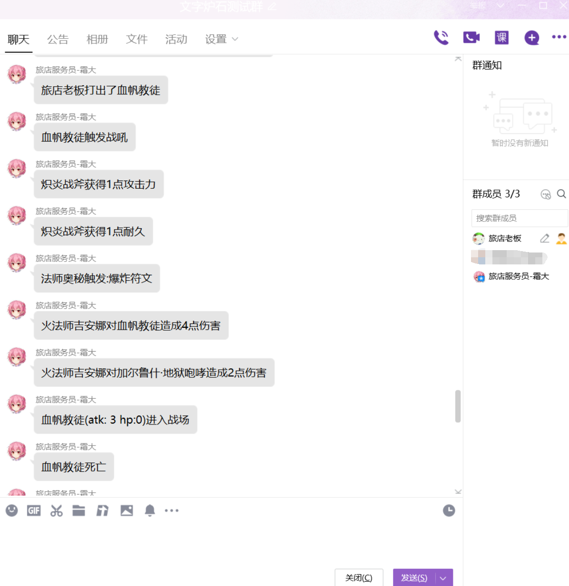

# Java - 炉石传说
## 这是什么
这是用Java语言实现的游戏--炉石传说
- 实现了什么功能
  - [ ] 炉石传说
    - [ ] 主要组件
      - [x] 随从
      - [x] 英雄
      - [x] 武器
      - [x] 奥秘
      - [ ] 任务
    - [ ] 卡牌关键效果
      - [x] 随从特效
      - [x] 战吼
      - [x] 亡语
      - [ ] <a href="#otherCard">其他卡牌效果</a>
    - [ ] 卡牌
      - [ ] 基础包
      - [ ] 经典包
      - [ ] 荣誉室
      - [ ] <a href="#otherClass">其他扩展包</a>
    - [ ] AI
    - [x] QQ群对战
  - [ ] 酒馆战棋

- 效果图




## 包含组件
| 模块             | 介绍        | 功能描述                                      |
| -------------    | -------    | ---------------------                        |
| hearth-core      | 核心模块    | 整个游戏的架构，接口                            |
| hearth-card      | 卡牌模块    | 游戏的卡牌各种具体实现                          |
| hearth-control   | 控制器模块  | 游戏的测试启动和控制器,目前只能以文字的交互形式启动  |
| card-generator   | 卡牌生成器  | 从暴雪的卡牌数据库中生成对应的java类              |

## 快速开始
- 克隆项目
- 编译
  - 使用maven工具 install核心模块【hearth-core】
  - 在【card-generator】模块中运行cn/eiden/hsm/util/XmlUtil.java
  - 使用maven工具 install全部模块【hearth】
- 运行
  - 项目的测试运行全部都在【hearth-control】模块中
  - java控制台运行
    - 运行cn/eiden/hsm/cockpit/console/ConsoleCockpit.java
  - QQ运行
    - qq模块使用http插件，系统中使用的是酷Q
    - <a href="#coolq">安装配置酷Q</a>
    - 运行cn/eiden/hsm/cockpit/coolq/HearthApplication.java
  - 微信运行（未实装）
  
<a name="coolq"></a>


#### 安装和配置酷Q

#### 1. 下载 [酷Q](https://cqp.cc/)... (如果有 酷Q Pro 的话效果更好哦!)
下载完后解压到你想安装的目录下<br>
首次启动请运行 `cqa.exe` 或 `cqp.exe`, 并登陆机器人的 QQ 号<br>
然后退出 酷Q (右键悬浮窗点退出)<br>

#### 2. 添加 [酷Q HTTP 插件](https://cqp.cc/t/30748):
把 `.cpk` 文件下载下来, 放进 `酷Q安装目录\app` 文件夹里<br>
启动 酷Q<br>
右键悬浮窗, 然后点击 `应用 -> 应用管理`<br>
列表里现在应该有 `[未启用] HTTP API`, 点击它, 点击启用<br>
启用的时候会提示需要一些敏感权限, 选择继续<br>
启用之后在 `酷Q安装目录\app` 文件夹里会出现 `io.github.richardchien.coolqhttpapi` 文件夹<br>
退出 酷Q<br>

#### 3. 配置 酷Q HTTP 插件:
在 `io.github.richardchien.coolqhttpapi` 文件夹里创建一个文件名为 `config.cfg` 的配置文件<br>
并在其中写入以下代码<br>

```
[general]
host=0.0.0.0
port=接收端口
post_url=http://127.0.0.1:发送端口
enable_backward_compatibility=false
```

把发送端口和接收端口改成你的机器人程序里用的端口 (测试机器人的接收为`31091`, 发送`31092`)<br>
注意: 酷Q 配置里的`发送端口`要和传进 Picq 的`接收端口`一样, 然后 Picq 的`发送端口`也要和 酷Q 的`接收端口`一样!<br>
( 这是因为 酷Q 需要发送到 Picq 的接收端口去, 而不是发送到对方的发送端口ww )<br>
如果 酷Q 要和你的机器人程序分开运行的话, 请把`127.0.0.1`改成你的机器人部署的服务器的地址<br>
保存配置文件<br>

#### 4. 配置完成! 启动 酷Q!


## 如何扩展添加新的卡牌

#### 附录

<a name="otherCard"></a>
- [ ] 卡牌关键效果及其部分demo示例（已经实现但没有示例的为自动生成，无需重写）
  - [x] 随从特效 
  <a href="hearth-card/src/main/java/cn/eiden/hsm/game/card/classic/warrior/FrothingBerserkerCard.java">暴乱狂战士</a>
  <a href="hearth-card/src/main/java/cn/eiden/hsm/game/card/brm/neutral/GrimPatronCard.java">恐怖的奴隶主</a>
  - [x] 战吼
  <a href="hearth-card/src/main/java/cn/eiden/hsm/game/card/ungoro/mage/ArcanologistCard.java">秘法学家</a>
  <a href="hearth-card/src/main/java/cn/eiden/hsm/game/card/kara/mage/MedivhSValetCard.java">麦迪文的男仆</a>
  <a href="hearth-card/src/main/java/cn/eiden/hsm/game/card/classic/mage/KirinTorMageCard.java">肯瑞托法师</a>
  - [x] 亡语
  <a href="hearth-card/src/main/java/cn/eiden/hsm/game/card/naxx/MadScientistCard.java">疯狂的科学家</a>
  <a href="hearth-card/src/main/java/cn/eiden/hsm/game/card/base/LeperGnomeCard.java">麻风侏儒</a>
  - [x] 嘲讽
  - [x] 冲锋
  - [x] 法强
  - [x] 光环
  <a href="hearth-card/src/main/java/cn/eiden/hsm/game/card/classic/SouthseaCaptainCard.java">南海船长</a>
  - [x] 风怒
  - [x] 圣盾
  - [x] 潜行
  - [x] 剧毒
  - [x] 沉默
  - [x] 冻结
  <a href="hearth-card/src/main/java/cn/eiden/hsm/game/card/dalaran/mage/RayOfFrostCard.java">霜冻射线</a>
  - [ ] 抉择
  - [x] 连击
  <a href="hearth-card/src/main/java/cn/eiden/hsm/game/card/classic/rogue/Si7AgentCard.java">军情七处特工</a>
  <a href="hearth-card/src/main/java/cn/eiden/hsm/game/card/classic/rogue/EviscerateCard.java">刺骨</a>
  - [x] 过载
  - [x] 吸血
  - [ ] 进化
  - [x] 突袭
  - [ ] 招募
  - [ ] 回响
  - [ ] 发现
  - [ ] 磁力
  - [ ] 超杀
  - [x] 免疫

<a name="otherClass"></a>
- [ ] 卡牌包
  - [ ] 基础包 CORE
  - [ ] 经典包 CLASSIC
  - [ ] 荣誉室 HOF
  - [ ] 纳克萨玛斯 NAXX
  - [ ] 地精大战侏儒 GVG 
  - [ ] 黑石山的火焰 BRM 
  - [ ] 冠军的试炼 AT
  - [ ] 探险者协会 LOE
  - [ ] 上古之神的低语 OG
  - [ ] 卡拉赞之夜 KAR
  - [ ] 龙争虎斗加基森 CFM
  - [ ] 勇闯安戈洛 UNG 
  - [ ] 冰封王座的骑士 ICC
  - [ ] 狗头人与地下世界 LOOT
  - [ ] 女巫森林 GIL
  - [ ] 砰砰计划 BOT
  - [ ] 拉斯塔哈的大乱斗 TRL
  - [ ] 暗影崛起 DAL
  - [ ] 奥丹姆奇兵 ULD
  - [ ] 巨龙降临 DRG
  - [ ] 迦拉克隆的觉醒 YOD
  - [ ] 外域的灰烬 BT
  